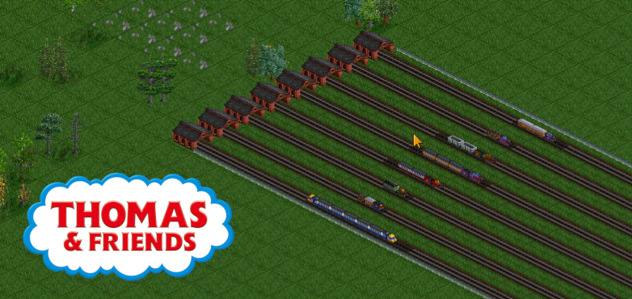
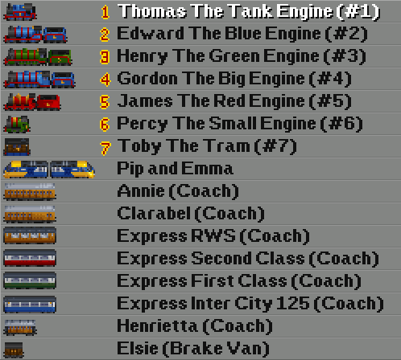

# Sodor Railways Expansion - The Thomas The Tank Engine set for OpenTTD


Sodor Railways Expansion is a train set for OpenTTD, including vehicles from the Thomas The Tank Engine universe

Drawn by DanMacK and others, coded by Audigex and Bazek, and based on the MUTS (Modern UK Train Set) build scripts and some code stolen (but not really, thanks GPLv2) from BRTrains

### Discussion forum post
Discuss the set, or contribute graphics (using the templates at ) in our TT-Forums thread
https://www.tt-forums.net/viewtopic.php?f=26&t=54189&start=40

### Train List


### Installation
Grab the latest release from the in-game content downloader.

Alternatively get it from the  page and copy it into your `OpenTTD/newGRF` folder.

### Building from Source
Building from the source should be mostly automated using the `build.py` script, but it has a few requirements:
  - Python3.* (Tested on Python3.6, Python3.7, Python3.8, Python3.9)
  - `nml` Python package (available through `pip`)
  
To build the grf completely, just run the following command in your terminal:
```bash
python build.py --compile OpenTTE
```
This should first compile the `.nml` file, then compile that through to a `.grf` file using `nml`.  Install in the same manner
as previously described, copying the generated `.grf` file into `OpenTTD/newGRF`.

To copy the grf and start the game, closing all existing instances, run the following command in your terminal of choice:
```bash
python build.py --run OpenTTE
```
This will also perform the --compile function, and will not start the game if an error is thrown during the compilation process.


### Credits

#### Developers

- Audigex
- Bazek

#### Artists

- DanMacK (Original art)
- Audigex (Modifications for release)
- Bazek (Modifications)
- Fabiana (additional art)

### Contributing
- Fork the project, make your changes, submit a pull request
- Or just send us a sprite sheet with your new vehicles and we will add it (use  Directory)
- https://www.tt-forums.net/viewtopic.php?f=26&t=54189&start=40

### License
This project is licensed under the GPLv2 license
See [LICENSE](./LICENSE) for license details
